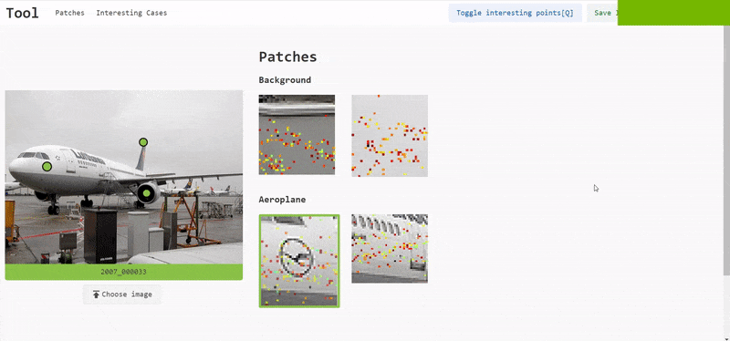

# Pixelwise GradCAM Visualisation of Semantic Segmented Images

This tool aims to merge GradCAM and Semantic Segmentation visualization to gain a deeper understanding in how Deep learning models take decisions to segment objects in an image. Contrary to GradCAM visualisation of the whole image, pixel wise GradCAM is done to understand what pixels are responsible to decide the class value of pixel in focus in semantic segmented image.

## Pre-Requisites
Python 3 with numpy and opencv is required to run data augmentation script if data from backend is not available

## Data Augmentation
Since currently the backend is not available, run the `augmentData.py` script to create augmented GradCAM pixels for each pixel in the image.  
Run the following command in CMD:

    >>> augmentData.py "path/to/image/image.jpg"
        
	[100% completed]
    GradCAM data for [2007_000738] generated in [web/data/2007_000738/2007_000738.csv]

    
 It will output the csv file in 

     ...
	 ├── web
     ├── data                  	
         ├── imageName          	
             ├── imageName.csv     # Csv file containing GradCAM data
         ├─interesting.json
     ...

It is recommended to place the original and semantic segmented image in this folder for easy file picking while running the tool.

PS. The images being used as examples are taken from [VOC Dataset](http://host.robots.ox.ac.uk/pascal/VOC/voc2012/index.html)
## Controls

| Controls                  | Main Image                                                                                                                  | Patch / GradCAM Image                                                                                                                                                               | Misc                                   |
|---------------------------|-----------------------------------------------------------------------------------------------------------------------------|-------------------------------------------------------------------------------------------------------------------------------------------------------------------------------------|----------------------------------------|
| `Mouse hover`             | Displays pixel information of pixel at cursor location along with bounding box containing all GradCAM pixels for that pixel | Points to patch and pixel location in Main image                                                                                                                                    |                                        |
| `Left Click`              | Creates a patch for pixel at cursor’s position in “Patches” section                                                         |                                                                                                                                                                                     |                                        |
| `Double click`            |                                                                                                                             | Adds/Removes the patch to a “Patch Comparison” container to compare patches                                                                                                         |                                        |
| `Ctrl+LeftClick`       |                                                                                                                             | Toggles the patch as an “Interesting Patch” by adding/removing a border to it and adding/removing a corresponding “blinking circle of interest” in Main image at the pixel location |                                        |
| `Ctrl+Alt+LeftClick` | Removes interesting points (if exist)                                                                                                                            | Removes the patch from “Patches” section                                                                                                                                            |                                        |
| `Shift+ScrollUp/Down`  | Changes opacity of input image to see semantic segmented image overlay                                                      | Changes opacity of GradCAM pixels                                                                                                                                                   |                                        |
| `Q`                       |                                                                                                                             |                                                                                                                                                                                     | Toggle interesting Points visibility   |
| `S`                       |                                                                                                                             |                                                                                                                                                                                     | Save interesting points into JSON file |

 
## Instructions to run the tool
1. Clone the repository using `git clone`
2. Browse to `/web` folder and create a HTTP server by opening CMD or Powershell window in the folder and running `python -m http.server 8000`
3. Type `localhost:8000` in the browser to run the tool

## Usage
### Main image interaction and patch creation
1. Hover on main image to see per-pixel information in a *Floating window*. *Bounding box* (Patch) for each pixel containing surrounding GradCAM pixels (pixels which are responsible for deciding the class of pixel in focus) is also rendered.

2. Use `Shift+Scroll Up/Down` to control the opacity of semantic segmented image overlay on the main image.

3. Main image shows *Blinking interesting points* previously chosen by the user for the image currently opened. These points are stored in a json file for persistent storage.

5. Clicking on a pixel generates its patch in Patches section containing original image pixels with GradCAM pixels overlayed on them.  Clicking an interesting point generates patch with border around it

6. Hovering on a patch shows the pixel and bounding box in the main image.

7. Moving Thumbs on the *Gradient slider* or the slider itself filters the GradCAM pixels visible. Colors are mapped according to pixel weights i.e. according to their importance in decision making

8. With the aforementioned controls, various actions like Patch deletion, Patch comparison, setting patch as interesting, changing opacity of GradCAM pixels can be done.

9. Images which contain interesting points are mention by their name in the "Interesting Cases" section. Clicking them will auto load the image along with it's csv data if it is in the data folder in the following format
	 
		 ...
		 ├── web
	     ├── data                  	# data folder
	         ├── imageName          	# Load and stress tests
	             ├── imageName.jpg     # Original image
	             ├── imageName.png     # Semantic Segmented Image
	             ├── imageName.csv     # Csv file containing GradCAM data
	         ├─interesting.json
	     ...
	  If the image doesn't exist in the following format, file picker dialog will open for manual file browsing

10. Clicking *Choose Image* button opens 3 file picker dialogs for Original image, Semantic Segmentation image and CSV file in sequence.

11. Visibility of Interesting points can be toggled by pressing `Q` on the keyboard and Interesting points can be saved into a JSON file by pressing `S` on the keyboard. These actions can also be performed by pressing the buttons in the nav bar. Interesting points are stored in `interesting.json` inside `web/data/` folder. The tool auto loads points from this file, but they can be exported to a  different file as well but auto loading would not work

# Credits
Colormap: [https://github.com/bpostlethwaite/colormap](https://github.com/bpostlethwaite/colormap)
